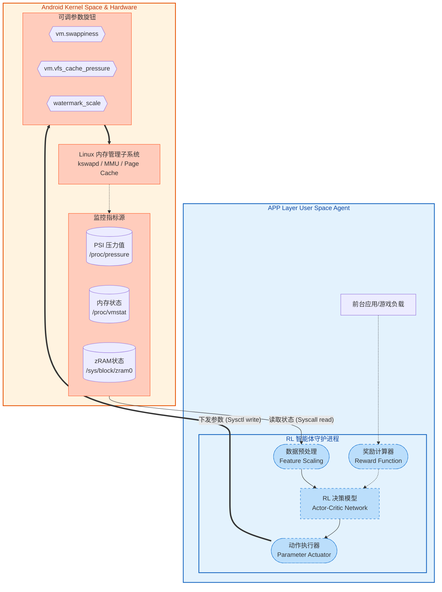

```mermaid
graph LR
    %% 整体流向改为从左到右
    
    %% 定义样式
    classDef phase1 fill:#e3f2fd,stroke:#1565c0,stroke-width:1px;
    classDef phase2 fill:#e8f5e9,stroke:#2e7d32,stroke-width:1px;
    classDef phase3 fill:#fff3e0,stroke:#ef6c00,stroke-width:1px;
    classDef phase4 fill:#f3e5f5,stroke:#7b1fa2,stroke-width:1px;
    classDef check fill:#fff,stroke:#333,stroke-width:2px,stroke-dasharray: 5 5;

    %% --- 第一阶段 ---
    subgraph P1 [第一阶段: 平台搭建]
        direction TB
        N1[环境准备<br>Rooted/Emulator] --> N2[ADB与脚本开发]
        N2 --> N3[内核接口验证]
        N3 --> C1{接口<br>可行?}
    end

    %% --- 第二阶段 ---
    subgraph P2 [第二阶段: 数据分析]
        direction TB
        N4[基准测试<br>Benchmark] --> N5[采集时序数据<br>PSI/Mem]
        N5 --> N6[特征工程<br>状态空间定义]
    end

    %% --- 第三阶段 ---
    subgraph P3 [第三阶段: 模型训练]
        direction TB
        N7[构建RL环境<br>Gym Wrapper] --> N8[PPO网络设计]
        N8 --> N9[模型训练<br>Reward设计]
        N9 --> C2{收敛<br>达标?}
    end

    %% --- 第四阶段 ---
    subgraph P4 [第四阶段: 验证评估]
        direction TB
        N10[端侧部署<br>User Daemon] --> N11[闭环A/B测试]
        N11 --> N12((论文撰写<br>与结题))
    end

    %% --- 阶段间连接 ---
    C1 -- Yes --> N4
    N6 --> N7
    C2 -- Yes --> N10

    %% --- 反馈回路 (画在下方) ---
    C1 -- No --> N2
    C2 -- No --> N9

    %% 应用样式
    class N1,N2,N3,C1 phase1;
    class N4,N5,N6 phase2;
    class N7,N8,N9,C2 phase3;
    class N10,N11,N12 phase4;
    class C1,C2 check;
```

```mermaid
graph TB
    %% --- 定义样式 ---
    classDef userSpace fill:#e3f2fd,stroke:#1565c0,stroke-width:2px,color:#0d47a1;
    classDef kernelSpace fill:#fff3e0,stroke:#e65100,stroke-width:2px,color:#bf360c;
    classDef AIComponent fill:#bbdefb,stroke:#1976d2,stroke-dasharray: 5 5;
    classDef KernelComponent fill:#ffccbc,stroke:#ff5722;

    %% ====== 顶层：用户态智能体 ======
    subgraph UserSpace [APP Layer User Space Agent]
        direction TB
        
        subgraph RL_Daemon [RL 智能体守护进程]
            direction LR
            DataProc([数据预处理<br>Feature Scaling]) --> Brain[RL 决策模型<br>Actor-Critic Network]
            Brain --> ActionExe([动作执行器<br>Parameter Actuator])
            RewardCalc([奖励计算器<br>Reward Function]) -.-> Brain
        end

        %% 应用层负载输入
        AppLoad[前台应用/游戏负载] -.-> RewardCalc
    end

    %% ====== 中间层：系统调用接口 ======
    %% 这一层是概念上的边界，通过连线上的文字体现

    %% ====== 底层：Android 内核空间 ======
    subgraph KernelSpace [Android Kernel Space & Hardware]
        direction TB
            
        subgraph Monitor_Target [监控指标源 ]
            direction LR
            PSI[(PSI 压力值<br>/proc/pressure)]
            VMStat[(内存状态<br>/proc/vmstat)]
            ZRAMStat[(zRAM状态<br>/sys/block/zram0)]
        end

        subgraph Tuning_Knobs [可调参数旋钮]
            direction LR
            Swappiness{{vm.swappiness}}
            CachePressure{{vm.vfs_cache_pressure}}
            Watermark{{watermark_scale}}
        end

        %% 实际工作的内核子系统
        RealKernel[Linux 内存管理子系统<br>kswapd / MMU / Page Cache]
        
        Tuning_Knobs ==> RealKernel
        RealKernel -.-> Monitor_Target
    end

    %% ====== 跨层交互连线 ======
    %% 1. 感知路径 (Observation)
    Monitor_Target -- "读取状态 (Syscall read)" --> DataProc
    
    %% 2. 决策路径 (Action)
    ActionExe == "下发参数 (Sysctl write)" ==> Tuning_Knobs

    %% 应用样式
    class UserSpace,RL_Daemon userSpace;
    class KernelSpace kernelSpace;
    class DataProc,Brain,ActionExe,RewardCalc AIComponent;
    class Monitor_Target,Tuning_Knobs,RealKernel KernelComponent;
```

